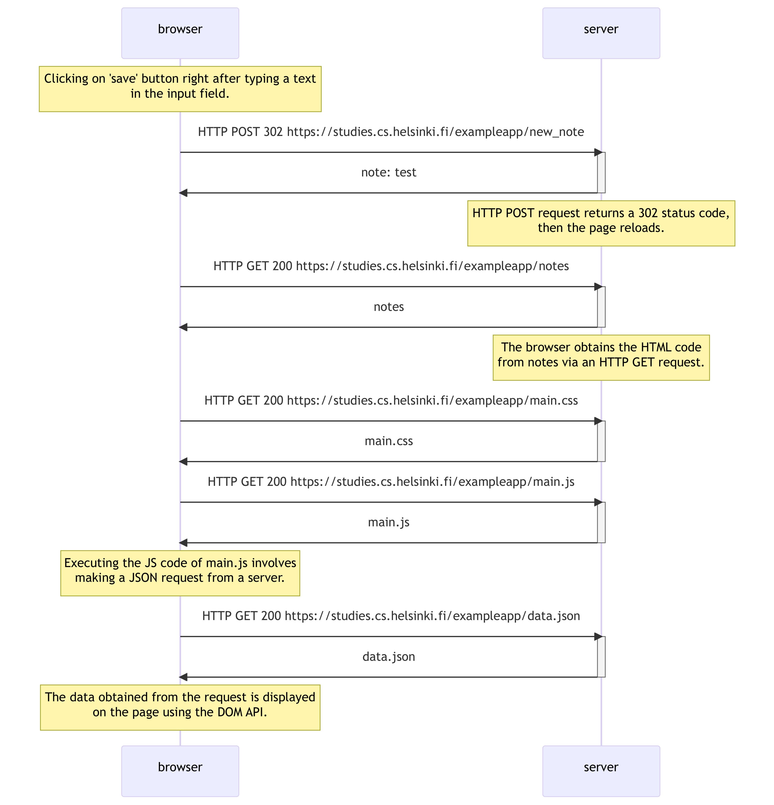
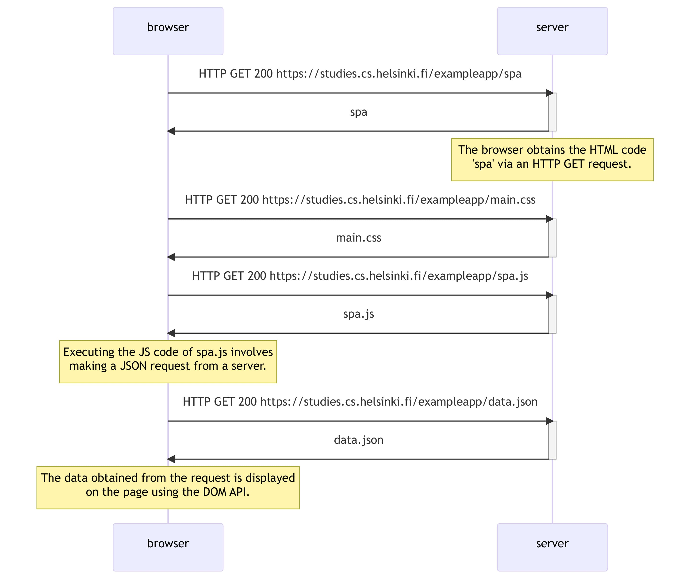
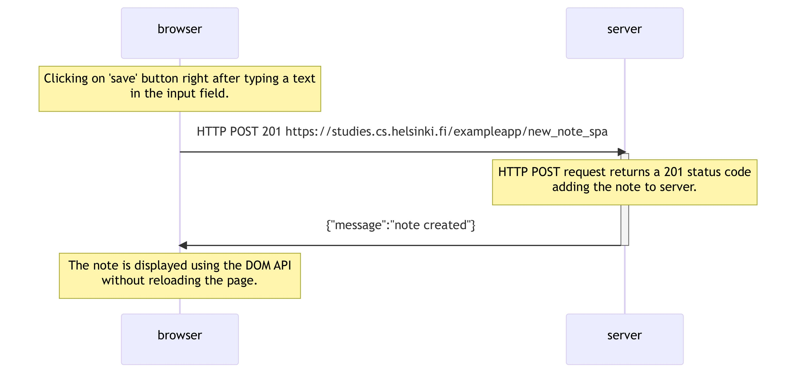

# 0.4 New note



```
sequenceDiagram
  title 0.4: New note

  participant browser
  participant server

  Note over browser: Clicking on 'save' button right after typing a text <br> in the input field.

  browser ->> server: HTTP POST 302 https://studies.cs.helsinki.fi/exampleapp/new_note
  activate server
  server ->> browser: note: test
  deactivate server

  Note over server: HTTP POST request returns a 302 status code, <br> then the page reloads.

  browser ->> server: HTTP GET 200 https://studies.cs.helsinki.fi/exampleapp/notes
  activate server
  server ->> browser: notes
  deactivate server

  Note over server: The browser obtains the HTML code <br> from notes via an HTTP GET request.

  browser ->> server: HTTP GET 200 https://studies.cs.helsinki.fi/exampleapp/main.css
  activate server
  server ->> browser: main.css
  deactivate server

  browser ->> server: HTTP GET 200 https://studies.cs.helsinki.fi/exampleapp/main.js
  activate server
  server ->> browser: main.js
  deactivate server

  Note over browser: Executing the JS code of main.js involves <br> making a JSON request from a server.

  browser ->> server: HTTP GET 200 https://studies.cs.helsinki.fi/exampleapp/data.json
  activate server
  server ->> browser: data.json
  deactivate server

  Note over browser: The data obtained from the request is displayed <br> on the page using the DOM API.
```

# 0.5 SPA



```
sequenceDiagram
  title 0.5: SPA

  participant browser
  participant server

  browser ->> server: HTTP GET 200 https://studies.cs.helsinki.fi/exampleapp/spa
  activate server
  server ->> browser: spa
  deactivate server

  Note over server: The browser obtains the HTML code <br> 'spa' via an HTTP GET request.

  browser ->> server: HTTP GET 200 https://studies.cs.helsinki.fi/exampleapp/main.css
  activate server
  server ->> browser: main.css
  deactivate server

  browser ->> server: HTTP GET 200 https://studies.cs.helsinki.fi/exampleapp/spa.js
  activate server
  server ->> browser: spa.js
  deactivate server

  Note over browser: Executing the JS code of spa.js involves <br> making a JSON request from a server.

  browser ->> server: HTTP GET 200 https://studies.cs.helsinki.fi/exampleapp/data.json
  activate server
  server ->> browser: data.json
  deactivate server

  Note over browser: The data obtained from the request is displayed <br> on the page using the DOM API.
```

# 0.6 New note on SPA



```
sequenceDiagram
  title 0.6: New note on SPA

  participant browser
  participant server

  Note right of browser:  Clicking on 'save' button right after typing a text in the input field.

  browser ->> server: HTTP POST 201 https://studies.cs.helsinki.fi/exampleapp/new_note_spa
  activate server
  server ->> browser: {"message":"note created"}
  deactivate server

  Note right of browser: HTTP POST request returns a 201 status code, then the text is displayed without reloading the page.
```
